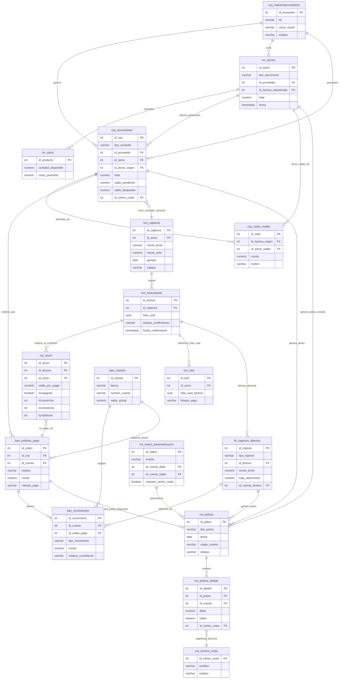

```mermaid
erDiagram
    sys_maestroproveedores ||--o{ cxp_documentos : "genera"
    sys_maestroproveedores ||--o{ inv_doctos : "surte"

    kzn_capenca ||--o{ kzn_facturaanda : "origina"
    kzn_facturaanda ||--o{ my_acum : "duplica_al_confirmar"
    kzn_facturaanda ||--o{ kzn_ba4 : "referencia_folio_uuid"
    kzn_facturaanda ||--o{ fin_ingresos_alternos : "factura_opcional"

    my_acum }o--|| ban_ordenes_pago : "se_paga_via"

    inv_doctos ||--o{ inv_stock : "actualiza"
    inv_doctos ||--o{ cxp_documentos : "detona_generacion"
    inv_doctos ||--o{ cxp_notas_credito : "docto_salida_de"

    cxp_documentos ||--o{ cxp_notas_credito : "afectada_por"
    cxp_documentos ||--o{ ban_ordenes_pago : "cubierta_por"
    cxp_documentos }o--|| sys_maestroproveedores : "proveedor"
    cxp_documentos }o--|| kzn_capenca : "socio_acreedor_opcional"

    ban_cuentas ||--o{ ban_movimientos : "registra"
    ban_cuentas ||--o{ ban_ordenes_pago : "dispersa_desde"
    ban_ordenes_pago ||--o{ ban_movimientos : "genera"

    cnt_matriz_parametrizacion ||--o{ cnt_polizas : "parametriza"
    cnt_polizas ||--o{ cnt_polizas_detalle : "contiene"
    cnt_polizas_detalle }o--|| cnt_centros_costo : "segmenta_opcional"

    fin_ingresos_alternos ||--o{ ban_movimientos : "deposita_en"
    fin_ingresos_alternos ||--o{ cnt_polizas : "genera_poliza"

    cxp_documentos ||--o{ cnt_polizas : "genera_poliza"
    inv_doctos ||--o{ cnt_polizas : "genera_poliza_entrada"
    ban_ordenes_pago ||--o{ cnt_polizas : "genera_poliza_dispersión"

    kzn_capenca {
        int id_capenca PK
        int id_socio FK
        numeric monto_bruto
        numeric monto_neto
        date periodo
        varchar estatus
    }
    kzn_facturaanda {
        int id_factura PK
        int id_capenca FK
        uuid folio_uuid
        varchar estatus_confirmacion
        timestamp fecha_confirmacion
    }
    my_acum {
        int id_acum PK
        int id_factura FK
        int id_socio FK
        numeric saldo_por_pagar
        boolean kznpagedo
        int kznanohche
        int kznmeshche
        int kzndiahche
    }
    kzn_ba4 {
        int id_ba4 PK
        int id_socio FK
        uuid folio_uuid_factura
        varchar bloque_pago
    }
    inv_doctos {
        int id_docto PK
        varchar tipo_documento
        int id_proveedor FK
        int id_factura_relacionada FK
        numeric total
        timestamp fecha
    }
    inv_stock {
        int id_producto PK
        numeric cantidad_disponible
        numeric costo_promedio
    }
    sys_maestroproveedores {
        int id_proveedor PK
        varchar rfc
        varchar razon_social
        varchar estatus
    }
    cxp_documentos {
        int id_cxp PK
        varchar tipo_acreedor
        int id_proveedor FK
        int id_socio FK
        int id_docto_origen FK
        numeric total
        numeric saldo_pendiente
        numeric saldo_bloqueado
        int id_centro_costo FK
    }
    cxp_notas_credito {
        int id_nota PK
        int id_factura_origen FK
        int id_docto_salida FK
        numeric monto
        varchar motivo
    }
    ban_cuentas {
        int id_cuenta PK
        varchar banco
        varchar numero_cuenta
        numeric saldo_actual
    }
    ban_movimientos {
        int id_movimiento PK
        int id_cuenta FK
        int id_orden_pago FK
        varchar tipo_movimiento
        numeric monto
        varchar estatus_conciliacion
    }
    ban_ordenes_pago {
        int id_orden PK
        int id_cxp FK
        int id_cuenta FK
        varchar estatus
        numeric monto
        varchar metodo_pago
    }
    fin_ingresos_alternos {
        int id_ingreso PK
        varchar tipo_ingreso
        int id_factura FK
        numeric monto_bruto
        numeric total_retenciones
        int id_cuenta_destino FK
    }
    cnt_matriz_parametrizacion {
        int id_matriz PK
        varchar evento
        int id_cuenta_debe FK
        int id_cuenta_haber FK
        boolean requiere_centro_costo
    }
    cnt_polizas {
        int id_poliza PK
        varchar tipo_poliza
        date fecha
        varchar origen_evento
        varchar estatus
    }
    cnt_polizas_detalle {
        int id_detalle PK
        int id_poliza FK
        int id_cuenta FK
        numeric debe
        numeric haber
        int id_centro_costo FK
    }
    cnt_centros_costo {
        int id_centro_costo PK
        varchar nombre
        varchar estatus
    }
```
